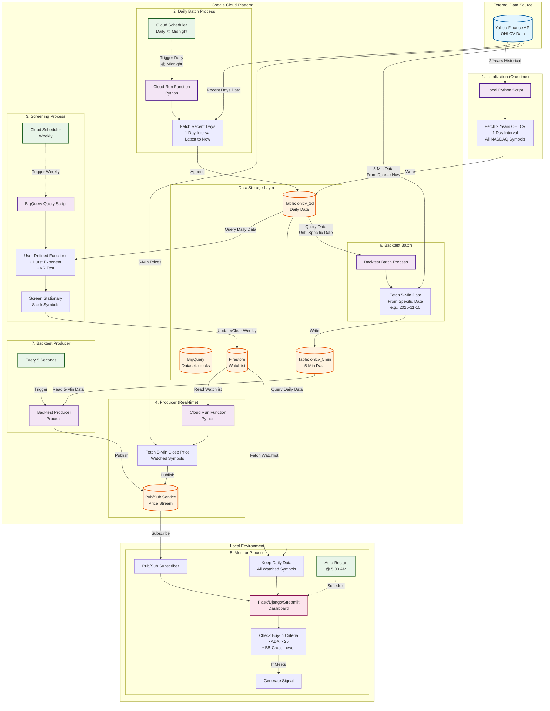

## Objective

This project aims to backtest (or realtime predict) the buy-in signal of the candidate stock symbols, which were screened by some statistical method (Hurst, VR test). We utilize a bunch of services in Google Serverless platform, including BigQuery, FireStore, CloudRun, Pub/Sub. We use a hybrid architecture since some programs run locally via API call. 

## Design 

1. Initialization
  - Fetch all the Nasdaq stock symbols' 2 years OHCLV (open, high, close, low prices and volume) with 1 day interval from Yahoo finance. 
  - Implemented by a local python script since this script is only for initialization and run once before the system runs continuously. 
  - Use Google `BigQuery` API write the data directly into an existing table `ohclv_1d` in Dataset `stocks` in Google BigQuery service.

2. Daily Batch
  - Fetch all the Nasdaq stock symbols' recent days (the latest day in table to now) OHCLV with 1 day interval from Yahoo finance.
  - Implemented by a CloudRun function using Python script.
  - Scheduled running in every midnight (the exact time depends on the yahoo finance, when the data is ready and avoid the maintenance window)
  - Append the data directly into `ohclv_1d` table

3. Screening
  - Schedule a `BigQuery` query script running weekly (Run once after initialization data is ready)
  - Use predefined User Defined Functions (UDFs) `(Hurst, VR test)` screening the stationary stock symbols.
  - Update the symbols into `Firestore` watchlist
  - Clear the symbols weekly

4. Producer
  - Fetch watched symbols' 5 min close price from yahoo finance
  - Implemented by a CloudRun function using Python script
  - Feed the price into Pub/Sub service

5. Monitor
  - Subscribe the price in Pub/Sub service
  - Keep all the daily data of watched symbols (from `Firestore` watchlist)
  - Check the buy-in criterion (`ADX > 25` and `Bollinger Band` cross lower line)
  - Signal if meets
  - Restart the program before the market open (5:00 am)
  - Implement as a local run program or web site (e.g., Python Flask/Django dashboard or Streamlit app)
 
6. Backtest Batch
  - Keep the daily data end with a specific date, such as `2025-11-10`
  - Fetch the 5 min data from the specific date till now, then write into `ohclv_5min` table in Dataset `stocks` in BigQuery.

7. Backtest Producer
  - Get the data from `ohclv_5min` table every 5 second
  - Then feed the data into Pub/Sub service

